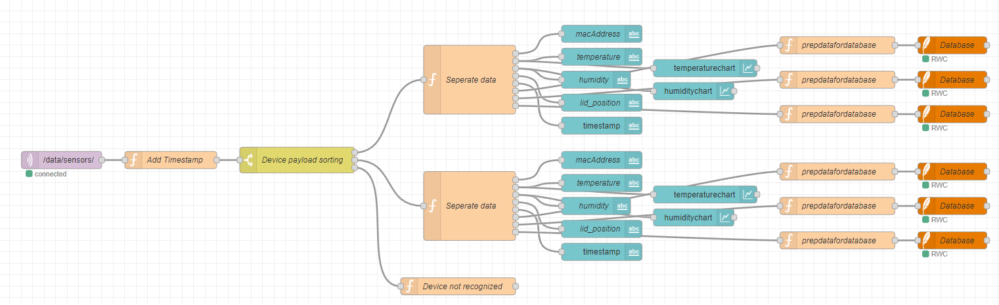
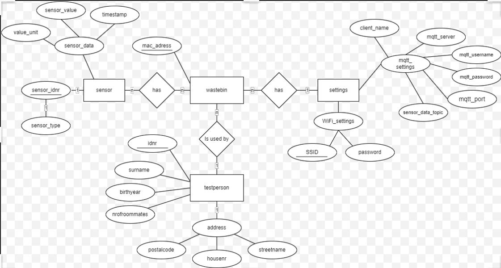

# Het Gebruik van meerdere ESP32-Microcontrollers met Node-Red

## Inleiding

Meerdere ESP32-microcontrollers kunnen in combinatie met Node-Red worden gebruikt om een visuele interface te bouwen op basis van de gegevens die zijn gelogd door de ESP32. Elke ESP32 kan worden geconfigureerd om gegevens van een specifieke sensor of apparaat te loggen en deze via Wi-Fi naar Node-Red te verzenden. Node-Red kan vervolgens de gegevens ontvangen en verwerken met behulp van verschillende nodes.

## Doelen

### Doel #1

Het opzetten van een systeem waarbij meerdere ESP32-microcontrollers worden gebruikt om gegevens te loggen en deze naar Node-Red te verzenden voor visualisatie en verwerking.

## Onderbouwing keuze ESP32 C3

Wij kiezen voor een ESP32 omdat deze de volgende voordelen biedt:

- Relatief goedkoop (€2 per stuk).
- Beschikbaarheid (1300 op voorraad bij Mouser, afhankelijk van het model).
- Geschikt voor de taken die moeten worden uitgevoerd.
- Compact formaat.

## Waarom geen Arduino of Raspberry Pi als computer voor de WasteBin?

Raspberry Pi's zijn momenteel moeilijk verkrijgbaar, duur in aanschaf voor een testplatform en vereisen meer inspanning om op te zetten. Bovendien zijn ze vaak te krachtig voor onze doeleinden en daardoor overbodig qua rekenkracht.
Arduino's zijn redelijke alternatieven, maar duurder dan losse ESP32-modules. Desalniettemin kunnen ESP32-modules via de Arduino IDE worden geprogrammeerd met behulp van de Arduino-codebibliotheken, indien gewenst.

## Data forwarding

Data forwarding is de plaats waar alle data van de ESP32's (of vuilnisbakken) wordt verzameld. Een mogelijke optie is het gebruik van specifieke hardware, zoals een Raspberry Pi met een broker (zoals Mosquitto) en een Node-Red-dashboard.
Wij kiezen ervoor om de broker en het dashboard op onze lokale laptop te installeren in plaats van een Raspberry Pi te gebruiken. We hebben hiervoor meerdere redenen:

1. We vermijden de noodzaak van een extra apparaat (Raspberry Pi). Alles op één apparaat maakt het eenvoudiger. Bovendien zijn Raspberry Pi's moeilijk verkrijgbaar en vormen ze een extra bron van potentiële hardwarefouten (zoals SD-kaartcorruptie) en softwareproblemen (Linux-problemen) enzovoort.
2. Als we fysiek ergens anders willen werken, zouden we steeds de Raspberry Pi moeten verbinden met het netwerk op die locatie via een beeldscherm en toetsenbord.
3. De Raspberry Pi kan een beveiligingsrisico vormen.

Stappen:

1. ESP32-gegevens laten versturen (verbinding maken met internet).
2. Opzetten van een MQTT-broker.
3. De MQTT-broker accepteert gegevens van de ESP32.
4. De MQTT-broker stuurt gegevens door naar Node-Red (lokaal).
5. Inkomende gegevens van de MQTT-broker worden omgezet naar een dashboardweergave.
6. Data van Node-Red doorsturen naar een database.

## De Data

De volgende gegevens willen we versturen vanaf de ESP32:

- Temperatuur (dubbel)
- Luchtvochtigheid (dubbel)
- Klepstand (boolean)
- Foutcodes (integer)
- WasteBin-ID (macadres)

Deze gegevens worden via MQTT naar Node-Red verzonden. Van daaruit worden de gegevens doorgestuurd naar een SQLite-database. We hebben gekozen voor SQLite vanwege de handige SQLiteStudio-omgeving waarin we de database gemakkelijk kunnen ontwerpen, opbouwen en testen.

## Meldingen voor de gebruiker

Voor onze opstelling willen we een luidspreker gebruiken als indicator die verschillende waarschuwingen kan afgeven wanneer dat nodig is. Deze waarschuwingen zijn onder andere:

- De klep staat te lang open (mogelijk)
- De binnenkant van de bak is te warm (mogelijk klep open of slechte koeling)
- Algemene fout (ander probleem)

We hebben ervoor gekozen om deze waarschuwingen ook naar ons dashboard te sturen als ze zich voordoen. Deze waarschuwingen worden weergegeven als foutcodes.

## Verstuur interval

In principe worden alle gegevens elke 15 minuten verstuurd. We denken dat dit voldoende informatie is voor elke vuilnisbak om eventuele problemen te detecteren (bijvoorbeeld te lage temperatuur). Bovendien voorkomt dit dat de database overvol raakt met gegevens, vooral wanneer er 30 vuilnisbakken zijn.

### In geval van fouten

In geval van een fout wordt dit interval genegeerd. Het interval wordt dan 2 minuten, indien er zich één of meerdere fouten blijven voordoen.

## Node-Red

We zullen Node-Red gebruiken om alle gegevens van MQTT te ontvangen, te verwerken en weer te geven. Alle ontvangen informatie wordt weergegeven via een Node-Red UI-tabblad. Dit UI-tabblad, ook wel "dashboard" genoemd in Node-Red, is uitbreidbaar indien gewenst. Alle prototype vuilnisbakken kunnen in real-time worden weergegeven op het dashboard als dat gewenst is.

De Node-Red UI ziet er als volgt uit voor twee vuilnisbakken:


### Node-Red flow

Om dit alles te laten werken, hebben we een Node-Red flow gemaakt. De Node-Red flow ziet er als volgt uit:



In deze flow ontvangt de eerste node (paars) de MQTT-gegevens. Vervolgens wordt er een tijdstempel aan het bericht toegevoegd en worden alle inkomende berichten gescheiden met behulp van een schakelaar (switch). De gegevens worden gescheiden op basis van het macadres (uniek) van de vuilnisbak.

Nadat de berichten zijn gescheiden, komen ze in een grote functieblok (oranje) dat het bericht analyseert en verdeelt over de uit puts van het functieblok. Ik heb hiervoor gekozen, zodat het functieblok modulair blijft en de uitvoer flexibel is. De uitvoer wordt gestuurd naar dashboardblokken (blauw) en naar nieuwe functieblokken die extra gegevens toevoegen (zoals sensor-ID) en deze als query naar een SQLite-database sturen.

## Database

Alle informatie wordt via Node-Red doorgestuurd naar een SQLite-database. Het doel van de database is om een doorzoekbare geschiedenis van alle ontvangen gegevens van de vuilnisbakken te creëren en een overzicht te bieden van alle gebruikers (testpersonen) en hun gegevens.

De database is als volgt opgebouwd:



Hierbij zijn alle onderstreepte woorden sleutelwaarden. Helaas toont het Database Entity Relationship-diagram (DBER) niet alle details, maar het geeft wel een goed overzicht van de databasestructuur.

De tabellen en relaties in de database zijn als volgt:

| Tabelnaam           | Veldnaam              | Type         | Relatie       |
|---------------------|-----------------------|--------------|---------------|
| Users               | UserID                | INTEGER      | PRIMARY KEY   |
|                     | Name                  | TEXT         |               |
|                     | Email                 | TEXT         |               |
|                     | Phone                 | TEXT         |               |
| WasteBins           | WasteBinID            | INTEGER      | PRIMARY KEY   |
|                     | Location              | TEXT         |               |
|                     | SensorID              | INTEGER      |               |
|                     | UserID                | INTEGER      | FOREIGN KEY   |
| SensorData          | SensorDataID          | INTEGER      | PRIMARY KEY   |
|                     | WasteBinID            | INTEGER      | FOREIGN KEY   |
|                     | Timestamp             | TIMESTAMP    |               |
|                     | Temperature           | REAL         |               |
|                     | Humidity              | REAL         |               |
|                     | ValveStatus           | INTEGER      |               |
|                     | ErrorCode             | INTEGER      |               |
| SensorStatus        | SensorID              | INTEGER      | PRIMARY KEY   |
|                     | Status                | TEXT         |               |
|                     | LastUpdated           | TIMESTAMP    |               |

Dit is de tabelstructuur voor de database, waarbij elke tabel de bijbehorende velden en datatypes bevat. De tabelrelaties zijn aangegeven met "PRIMARY KEY" en "FOREIGN KEY" om de verbanden tussen de tabellen weer te geven.

De database kan worden doorzocht met behulp van "views" in SQLiteStudio. Deze kunnen door de gebruiker worden gemaakt en aangepast.

Dit is een overzicht van de opzet voor het gebruik van meerdere ESP32-microcontrollers met Node-Red. Met deze configuratie kunnen we gegevens loggen van verschillende sensoren of apparaten, deze visualiseren op een dashboard en ze opslaan in een database voor verdere analyse en beheer.

### Views

Er zijn 3 views beschikbaar gemaakt voor de database.

Deze views zijn gemaakt om een sneller en beter inzicht te krijgen in bepaalde data combinaties.

Hier is een Markdown representatie van de drie views:

### View 1 : view_al_testpersons_with_wastebinnr

```
SELECT tp.*,
       wb.wastebinnr
  FROM testperson AS tp
       JOIN
       wastebin AS wb ON tp.idnr = wb.testperson
```

Deze query selecteert alle kolommen (`*`) uit de `testperson`-tabel en voegt de kolom `wastebinnr` uit de `wastebin`-tabel toe. De JOIN-operatie wordt uitgevoerd op basis van de overeenkomstige `idnr`-kolommen tussen de `testperson`- en `wastebin`-tabellen.

### View 2: view_all_sensors_data

```
SELECT s.sensor_type,
       CASE WHEN sensor_type = "lidposition" AND 
                 sd.sensor_value = 1 THEN 'closed' WHEN sensor_type = "lidposition" AND 
                                                        sd.sensor_value = 0 THEN 'open' ELSE sd.sensor_value END AS sensorvalue,
       sd.timestamp,
       sd.mac_address
  FROM sensor AS s
       JOIN
       sensordata AS sd ON s.sensor_idnr = sd.sensor_idnr
```

Deze query selecteert de kolommen `sensor_type`, `sensorvalue`, `timestamp` en `mac_address`. De `CASE`-expressie wordt gebruikt om de waarde van `sensorvalue` te bepalen op basis van voorwaarden. De JOIN-operatie wordt uitgevoerd op basis van de overeenkomstige `sensor_idnr`-kolommen tussen de `sensor`- en `sensordata`-tabellen.

### View 3: view_all_wastebin_settings

```
SELECT w.wastebinnr,
       w.mac_adress,
       s.SSID,
       s.password,
       s.mqtt_server,
       s.mqtt_username,
       s.mqtt_password,
       s.mqtt_port,
       s.sensor_data_topic,
       w.testperson
  FROM wastebin AS w
       JOIN
       settings AS s ON w.mac_adress = s.mac_adress
```

Deze query selecteert verschillende kolommen uit de `wastebin`- en `settings`-tabellen. De JOIN-operatie wordt uitgevoerd op basis van de overeenkomstige `mac_address`-kolommen tussen de twee tabellen.

De bovenstaande weergave is bedoeld om de query's in een leesbare vorm te presenteren.

Er word aangemoedigd om de views uit te breiden of aan te passen naar wens van de gebruiker.
