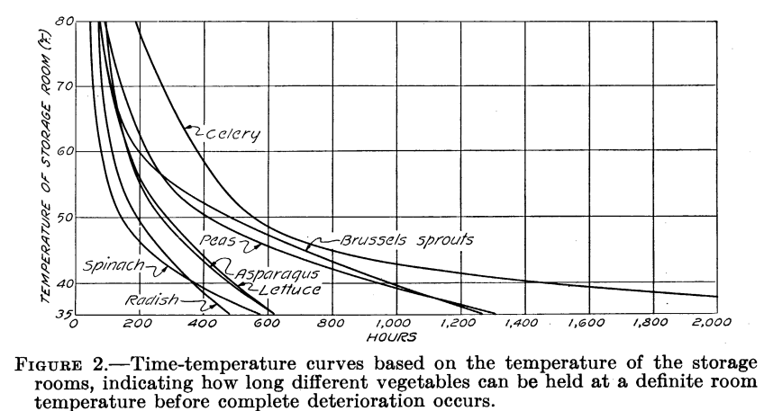

# Bureaubladonderzoek

## Hypotheses en feiten die baat hebben bij de ontwikkeling van de Waste Bin

### Inhoud

- [Tabellen](#tabellen)
- [Achtergrond informatie](#achtergrond-informatie)
- [Feiten](#feiten)
- [Hypotheses](#hypotheses)
- [Hoofd- en deelvragen](#hoofd--en-deelvragen)
- [Aanpak onderzoek en bron analyse](#aanpak-onderzoek-en-bron-analyse)
- [Uitwerking vragen](#uitwerking-vragen)
- [Bibliografie](#bibliografie)

## Tabellen

Tabel 1: Hypotheses

## Achtergrond informatie

Voor het WasteBin project zijn we gevraagd om een GFE-bak te ontwerpen die GFE-afval vrijwel geurloos en hygiënisch opslaat. Om het geurloze resultaat te bereiken, moeten we het rottingsproces zoveel mogelijk vertragen. Hierbij moeten we een balans vinden tussen energieverbruik, kosten en tijd. We moeten onderzoeken hoe deze factoren invloed hebben op de werking van het product. Daarnaast moeten we vragen beantwoorden zoals: is een ozon-generator überhaupt nodig als we het rottingsproces vertragen? In dit document stellen we tests op, voeren we ze uit en bespreken we de resultaten, om vervolgens onze conclusies te implementeren in ons (technisch) ontwerp.

## Feiten

- Een hoge luchtvochtigheid en temperatuur zorgen voor een sneller rottingsproces bij GFE-afval.
- Een te hoge concentratie ozon is gevaarlijk voor de gezondheid van de mens.
- Koude lucht kan een hogere luchtvochtigheid hebben dan warme lucht.

"Wanneer uurgemiddelde ozonconcentraties hoger zijn dan 180 microgram per kubieke meter lucht, is de luchtkwaliteit 'slecht'. Als deze waarde overschreden dreigt te worden, kunnen gevoelige mensen klachten krijgen en waarschuwt het RIVM. De luchtkwaliteit is 'zeer slecht' wanneer de concentraties drie uur lang hoger zijn dan 240 microgram per kubieke meter lucht. Wanneer deze waarde overschreden wordt, kan iedereen klachten krijgen. Als dit dreigt te gebeuren, zet het RIVM de waarschuwing om in een alarm." (RIVM, sd)

## Hypotheses

| Hypothese | Uitwerking/opmerkingen |
| --- | --- |
| Een gegeven materiaal houd zijn temperatuur beter vast dan lucht. | Thermoskan idee: hoe voller de thermoskan is gevuld met hete drank, hoe langer het duurt voor de inhoud is afgekoeld. Dus lucht ontnemen of de bak vullen met water om de optimale temperatuur makkelijk te behouden. |
| Water geleid temperatuur beter dan lucht. | Door de vuilnisbak met water te vullen en het GFE-afval in een zak hierin te koelen, zal dit een efficiëntere thermische overdracht hebben dan via de lucht. De verspreiding van de geur van het rottingsproces zal door het koelen van het GFE-afval minder snel plaatsvinden. Hierdoor is de ozon-generator overbodig. |
| Het invriezen van het GFE-afval stopt het rottingsproces volledig. | Het invriezen van het GFE-afval zal ervoor zorgen dat de micro-organismen die zich in het afval bevinden niet verder kunnen groeien. Sommige organismen kunnen dit alsnog doen, maar dit gebeurt langzamer en zal in de prullenbak nog niet plaatsvinden. |
| Het ontnemen van (een deel van) de zuurstof in combinatie met een ozon-generator remt het rottingsproces voldoende af. | De combinatie van een ozon-generator en minder zuurstof zal zorgen dat het afval dusdanig lang geremd wordt dat koeling niet nodig is. |

Hoofd- en deelvragen:

1. Wat heeft de grootste invloed op het rottingsproces?
   a. Welk effect heeft de omgevingstemperatuur op het rottingsproces?
      i. Hoeveel invloed heeft een negatieve temperatuur op het rottingsproces?
   b. Welk effect heeft luchtvochtigheid op het rottingsproces?
      i. Hoeveel effect heeft een lagere luchtvochtigheid op het rottingsproces?
   c. Welk effect heeft zuurstof op het rottingsproces?
      i. Welk effect heeft de aanwezigheid van zuurstof in een ruimte op het rottingsproces?
      ii. Hoeveel effect heeft zuurstof op het rottingsproces?
   d. Wat is de maximale tijd waarop het rottingsproces kan worden uitgesteld of vertraagd rekening houdend met de drie eerder genoemde factoren?
   e. Is het mogelijk om het effect van ozon-generatie te compenseren met koeling (tot en op het vriespunt)?

2. Hoeveel liter GFE-afval moet de WasteBin kunnen opslaan?
   a. Hoeveel liter GFE-afval produceert een gemiddeld huishouden per dag? (stedelijk gebied)
   b. Wat is het maximale volume van de prullenbak en is dit haalbaar?
   c. Wat verstaan we onder een huishouden?

3. Wat weerhoudt veel bewoners van hoogbouwwoningen ervan om hun GFE-afval te scheiden?
   a. Welke drempels kunnen we realistisch gezien verlagen om het scheidingssproces te bevorderen?

## Aanpak onderzoek en bronanalyse

Ons onderzoek, testen en documentatie zijn gebaseerd op het prototype dat ESE ontwikkelt voor Insyte. We zullen de vragen voornamelijk proberen op te lossen door gericht te zoeken op internet. We kunnen hiervoor bronnen gebruiken van Google Scholar of andere bronnen die betrouwbaar lijken. We zullen ook de bronnen gebruiken die door Insyte aan ons zijn geleverd. Deze bronnen zijn onderzoeken die onder andere zijn uitgevoerd door de HVA. Het is echter discutabel of deze bronnen betrouwbaar zijn, dus we zullen kijken naar hun werkwijze.

### Uitwerking vragen

**1. Wat heeft de grootste invloed op het rottingsproces?**
   De grootste invloed op het rottingsprocess is temperatuur.

   a. **Welk effect heeft de omgevingstemperatuur op het rottingsproces?**
   Volgens onderstaande grafiek neemt de afbraak van planten toe wanneer de temperatuur stijgt. Dit kan worden verklaard doordat veel bacteriën beter functioneren bij hogere temperaturen (broeien). Bij lagere temperaturen wordt het voor deze bacteriën moeilijker om te functioneren, waardoor het rottingsproces van planten vertraagt. Bij 40 graden Fahrenheit (4 graden Celsius) hebben deze groenten ongeveer 400 uur (16 dagen) nodig om het rottingsproces goed te starten. Het is gunstig om de omgevingstemperatuur laag te houden om het rottingsproces te vertragen.

   

   b. **Welk effect heeft luchtvochtigheid op het rottingsproces?**
   Bij een hoge luchtvochtigheid (vooral in combinatie met een hoge omgevingstemperatuur) kan er broei ontstaan in een bak, wat leidt tot de vorming van schimmels. Schimmels spelen ook een rol in het rottingsproces en kunnen onaangename geuren veroorzaken. Het is daarom belangrijk om de luchtvochtigheid zo laag mogelijk te houden.

   c. **Welk effect heeft zuurstof op het rottingsproces?**
   Schimmels zijn aerobe organismen, maar zelfs bij zeer lage zuurstofconcentraties is groei mogelijk (Wösten, 2017). Dit betekent dat het gunstig is om een omgeving met weinig zuurstof te creëren, maar het is niet het enige middel om het rottingsproces te voorkomen.

   d. **Wat is de maximale tijd waarop het rottingsproces kan worden uitgesteld of vertraagd rekening houdend met de drie eerder genoemde factoren?**
   Dit is afhankelijk van onder andere de inhoudsgrootte van de vuilnisbak, de staat van het GFE-afval tijdens wegwerpen en het gewenste energielabel in combinatie met de isolatie van de vuilnisbak.

   e. **Is het mogelijk om het effect van ozon-generatie te compenseren met koeling (tot en met het vriespunt)?**
   Op internet hebben we meerdere keren gelezen dat onjuist gebruik van ozongeneratoren kan leiden tot hoge concentraties ozon (O3), wat schadelijk is voor de gezondheid van organismen. Sommige mensen zijn gevoeliger dan anderen en kunnen negatieve gezondheidseffecten ervaren. Mensen die bijzonder kwetsbaar zijn, zijn onder andere kinderen, ouderen en mensen met astma (Government, 2015).

**2. Hoeveel liter GFE-afval moet de WasteBin kunnen opslaan?**
   De WasteBin moet zoveel liter GFE-afval kunnen opslaan.

   a. **Hoeveel liter GFE-afval produceert een gemiddeld huishouden per dag? (stedelijk)**
   Vanuit de gemeente Amsterdam is bekend dat er jaarlijks ongeveer tachtig kilo GFE-afval per persoon wordt weggegooid. Dit komt neer op ongeveer 200 gram per dag. Deze cijfers gelden specifiek voor stedelijke gebieden, waar het scheiden van dit afval moeilijker is vanwege de grote hoeveelheid hoogbouw.

   Jaarlijks produceert een gemiddeld persoon ongeveer tachtig kilo GFE-afval, maar hiervan belandt ongeveer 70 kilo bij het restafval omdat het niet gescheiden wordt (Schoonvelde, sd).

   b. **Wat is het maximale volume van de prullenbak en is dit realistisch?**
   Het optimale volume van de prullenbak moet afgestemd zijn op de grootte van de prullenbak die huishoudens al gebruiken. Op die manier zal de gebruiker, samen met het andere afval, ook het GFE-afval scheiden en de prullenbak volledig benutten. Volgens verschillende websites (Fonq.nl, brabantia.nl, prullenbak-expert.nl) is een 30-liter prullenbak geschikt voor één persoon, dus we gaan hier in dit geval van uit.

   In 2020 produceerde één persoon gemiddeld 140 kilo afval per jaar (totaal). Als we rekening houden met het feit dat er jaarlijks 70 tot 80 kilo GFE-afval wordt geproduceerd (waarvan slechts een deel van ongeveer 10 kilo wordt gescheiden), kunnen we stellen dat het volume van de GFE-afvalbak maximaal de helft zou moeten zijn (Rijksoverheid, sd).

**3. Wat weerhoudt veel bewoners van hoogbouwwoningen ervan om hun GFE-afval te scheiden?**
   Er zijn verschillende drempels die veel bewoners van hoogbouwwoningen ervan weerhouden om hun GFE-afval te scheiden.

   a. **Welke drempels kunnen realistisch gezien verlaagd worden zodat het scheidingsproces wel wordt uitgevoerd?**
   Er kunnen verschillende drempels worden verlaagd om het scheiden van GFE-afval te bevorderen. Enkele mogelijke drempels zijn de beschikbaarheid van aparte GFE-afvalbakken in hoogbouwwoningen, onduidelijkheid over wat wel en niet bij GFE-afval hoort en het gebrek aan bewustzijn en educatie over het belang van het scheiden van GFE-afval.

Om deze drempels te verlagen en het scheidingsproces te bevorderen, kunnen de volgende maatregelen worden genomen:

1. **Beschikbaarheid van aparte GFE-afvalbakken:** Het plaatsen van speciale GFE-afvalbakken in hoogbouwwoningen kan het scheiden van GFE-afval gemakkelijker maken. Deze bakken moeten voldoende capaciteit hebben en duidelijk gelabeld zijn.

2. **Duidelijke richtlijnen voor GFE-afval:** Het verstrekken van duidelijke informatie en richtlijnen over wat wel en niet bij GFE-afval hoort, kan verwarring verminderen en bewoners helpen bij het correct scheiden van hun afval. Dit kan worden gedaan door middel van educatief materiaal, zoals brochures, posters of online gidsen.

3. **Bewustmakingscampagnes:** Het uitvoeren van bewustmakingscampagnes gericht op hoogbouwwoningen kan het bewustzijn vergroten over de voordelen van het scheiden van GFE-afval. Deze campagnes kunnen informatie bevatten over de milieueffecten van GFE-afval, tips voor het verminderen van voedselverspilling en de positieve impact van afvalscheiding op het milieu.

4. **Samenwerking met afvalverwerkingsbedrijven:** Samenwerking met afvalverwerkingsbedrijven kan helpen bij het opzetten van efficiënte systemen voor het ophalen en verwerken van GFE-afval uit hoogbouwwoningen. Door het bieden van gemakkelijke en betrouwbare opties voor afvalverwijdering, kunnen bewoners worden aangemoedigd om actief deel te nemen aan het scheidingsproces.

Door deze maatregelen te implementeren, kunnen de drempels voor het scheiden van GFE-afval in hoogbouwwoningen worden verlaagd en kunnen bewoners worden gestimuleerd om actief deel te nemen aan het verminderen van voedselverspilling en het bevorderen van duurzaam afvalbeheer.

## Onderzoek naar koelmogelijkheden

Verschillende categorieën, uiteindelijk is alles een warmtepomp. Verschillende categorieën kunnen worden onderscheiden op basis van techniek, volume en temperatuur. Enkele voorbeelden van koeltechnieken zijn:

- Compressor
- Peltier-effect
- Magnetische koeling

Voor ons onderzoek hebben we besloten ons te richten op Peltier-modules. We hebben helaas niet genoeg tijd en geld om alle opties te onderzoeken en de peltier modules zijn bewezen effectief met koelen en betaalbaar. Deze modules hebben de volgende voordelen ten opzichte van andere koeloplossingen:

- Ze zijn verkrijgbaar in verschillende formaten, waaronder compacte formaten.
- Ze zijn relatief goedkoop in vergelijking met andere koeltechnieken.
- Ze werken geluidloos vanwege het solid-state cooling-principe.
- Er zijn geen extra gassen of waterleidingen nodig.

Het is echter belangrijk om het te koelen gebied goed te isoleren. Op deze manier kan de Peltier-module op een efficiënte manier koelen zonder constant op vol vermogen te werken, wat ook warmte genereert vanwege het feit dat het een warmtepomp is.

## Wat weerhoudt veel hoogbouwwoningbewoners ervan om hun GFE-afval te scheiden?

Uit het onderzoek "Vuilnis in de flat" van de Design Innovation Group kunnen we zien hoe de meeste mensen (22 in totaal) hun keuzes maken met betrekking tot afvalscheiding.

Op basis van dit onderzoek kunnen we concluderen dat voornamelijk de geur de uiteindelijke oorzaak lijkt te zijn voor het niet scheiden van GFE-afval. Om ervoor te zorgen dat dit scheidingsproces wel wordt uitgevoerd, kunnen we realistisch gezien de volgende drempels verlagen:

- We kunnen proberen de geur van het rottingsproces zoveel mogelijk te verminderen of te stoppen. Dit kan worden bereikt door het vertragen of stoppen van het rottingsproces, of door het verwijderen van de geuren die vrijkomen bij het rottingsproces.
- De specifieke aanpak om dit te bereiken moet nog worden vastgesteld.

"In diverse wijken in Utrecht wordt het GFT opgehaald. Eén geïnterviewde was in haar straat de enige die de GFT-bak buiten zet. Vaak werd die bak dan op de route vergeten. Twee geïnterviewden scheidden GFT maar zijn afgehaakt; de stank, vliegjes en natte zooi in huis werden als redenen gegeven." (designinnovationgroup, 2015)

**Bibliografie**

- Platenius, H. (1939). Effect of temperature on the rate of deterioration of fresh vegetables. Washinton, D.C.: Journal of Agricultural Research.
- Rijksoverheid. (sd). Opgehaald van Rijksoverheid.nl: [https://www.rijksoverheid.nl/onderwerpen/afval/huishoudelijk-afval](https://www.rijksoverheid.nl/onderwerpen/afval/huishoudelijk-afval)
- RIVM. (sd). Smog Door Ozon. Opgehaald van RIVM.nl: [https://www.rivm.nl/smog/smog-door-ozon](https://www.rivm.nl/smog/smog-door-ozon)
- Schoonvelde, G. (sd). Infomil.nl. Opgehaald van Infomil.nl: [https://www.infomil.nl/actueel/nieuws-perspectief-1/verbetering-afvalscheiding-hoogbouw-mits/](https://www.infomil.nl/actueel/n
