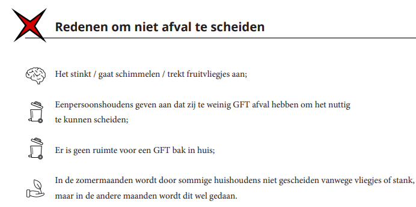
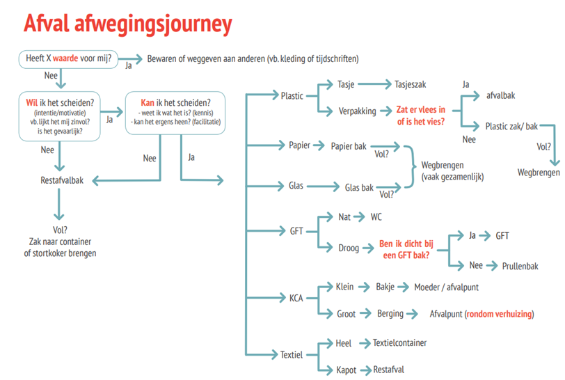

# WasteBin Project: Het creëren van een innovatieve oplossing voor geurvrije en milieuvriendelijke afvalverwerking

## Inleiding

Het WasteBin Project of de slimme vuilnisbak heeft als doel het probleem van onaangename geuren in kleine leefruimtes, zoals appartementen, aan te pakken, terwijl het efficiënte afvalscheiding en milieubehoud bevordert. Door de ontwikkeling van een uniek apparaat voorkomt dit project niet alleen onaangename geuren, maar stimuleert het ook gebruikers om verschillende soorten afval te scheiden, wat leidt tot effectievere recycling en een verminderde milieubelasting.

Op dit moment wordt afval helaas niet goed gescheden en uit onderzoek van de HvA blijkt dat hier een aantal redenen voor zijn.

en hiervoorafgaand is ook intrinsieke motivatie een factor. Hoe groter het gemak van scheiden, hoe groter de kans dat dit daadwerkelijk gedaan word.

Om deze motivatie te vergroten hebben wij daarom de volgende doelen opgesteld.

## Belangrijkste doelstellingen

1. Geurpreventie: Het primaire doel van het WasteBin Project is het creëren van een apparaat dat onaangename geuren die uit afvalbakken komen effectief opvangt en neutraliseert. Dit zal de leefomgeving aanzienlijk verbeteren voor mensen die in kleine ruimtes wonen.

2. Afvalscheiding: Door indirect het weggooien van algemeen voedselafval (GFE-afval) in reguliere afvalbakken te ontmoedigen, stimuleert het project de scheiding van verschillende soorten afval. Dit moedigt gebruikers aan om milieuvriendelijke praktijken te omarmen, wat resulteert in gemakkelijkere sortering van recyclebaar materiaal en een vermindering van afval op de vuilnisbelt.

3. Milieueffect: Het WasteBin Project draagt bij aan milieubehoud door de hoeveelheid afval die op de vuilnisbelt terechtkomt te minimaliseren. Door een betere scheiding van afval kunnen waardevolle recyclebare materialen gemakkelijker worden teruggewonnen, wat de winning van ruwe materialen vermindert en natuurlijke hulpbronnen beschermt.

## Kenmerken en functionaliteit van het apparaat

Het WasteBin-apparaat heeft verschillende innovatieve kenmerken om zijn doelstellingen te bereiken:

1. Mechanisme voor geurbeheersing: Het apparaat maakt gebruik van verschillende technologieën voor geurbeheersing, zoals temperatuurregeling, geactiveerde koolstoffilters en deodorizers, om onaangename geuren die uit afvalbakken komen vast te leggen en te neutraliseren. Dit zorgt voor een frisse en geurvrije leefomgeving voor gebruikers.

2. Hulp bij afvalscheiding: Het apparaat bevat een intuïtieve interface die gebruikers informeert over afvalscheidingspraktijken. Het biedt visuele indicatoren en herinneringen voor het scheiden van recyclebaar materiaal, organisch afval en andere categorieën, waardoor het proces gemakkelijk en gebruiksvriendelijk wordt.

3. Gebruiksvriendelijk ontwerp: Het WasteBin-apparaat is ontworpen om compact, esthetisch aantrekkelijk en gemakkelijk te gebruiken te zijn. Het past naadloos in kleine leefruimtes en vormt een aanvulling op het algehele interieurontwerp. De verwijderbare compartiment van het apparaat vereenvoudigd het afvalbeheer en de schoonmaakproces.

## Voordelen en impact

Het WasteBin Project biedt talrijke voordelen en positieve effecten:

1. Verbeterde levenskwaliteit: Door onaangename geuren te elimineren, verbetert het apparaat aanzienlijk de leefomgeving voor mensen die in kleine ruimtes wonen. Het bevordert comfort, welzijn en een aangename sfeer.

2. Verbeterde afvalscheiding: Het project moedigt gebruikers effectief aan om verschillende soorten afval te scheiden, wat leidt tot een hoger recyclingpercentage en een verminderde milieubelasting. Dit draagt bij aan een duurzamer afvalbeheersysteem.

3. Bewustwording en educatie: Het WasteBin-apparaat fungeert als een educatief hulpmiddel en vergroot het bewustzijn over het belang van afvalscheiding en de positieve milieu-impact ervan. Door verantwoord afvalbeheer te bevorderen, geeft het project gebruikers de mogelijkheid om milieuvriendelijke keuzes te maken.

4. Langetermijnduurzaamheid: Door het WasteBin Project wordt de adoptie van duurzame afvalbeheerpraktijken mainstream, wat een cultuur van milieubewustzijn bevordert en blijvende positieve veranderingen in afvalverwerkingsgewoonten teweegbrengt.

## Conclusie

Het WasteBin Project streeft ernaar een innovatief apparaat te creëren dat niet alleen onaangename geuren in kleine leefruimtes elimineert, maar ook afvalscheiding en milieuvriendelijkheid bevordert. Door geavanceerde mechanismen voor geurbeheersing, hulp bij afvalscheiding en gebruiksvriendelijke kenmerken te integreren, stelt het apparaat individuen in staat om actief een rol te spelen in het behoud van het milieu en tegelijkertijd hun levenskwaliteit te verbeteren. Met dit project streven we ernaar bij te dragen aan een schonere, groenere en meer duurzame toekomst voor iedereen.
