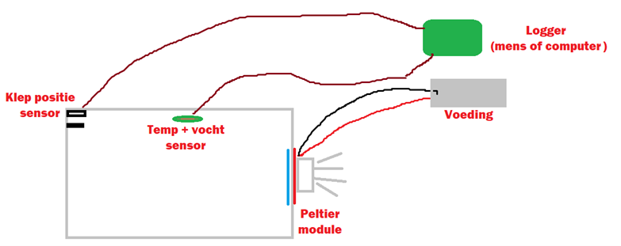

# Testplan

## Inhoud

- [Peltier modules](#peltier-modules)
- [Doelen](#doelen)
- [Deksel positie](#deksel-positie)
- [Temperatuur en luchtvochtigheid](#temperatuur-en-luchtvochtigheid)
- [Testopstelling](#testopstelling)
- [Vereiste componenten](#vereiste-componenten)
- [Meetapparatuur](#meetapparatuur)
- [Methodes](#methodes)
- [Testresultaten](#testresultaten)

## Peltier modules

De Peltier modules worden verder bestudeerd en getest om te kijken of deze geschikt zijn om te gebruiken voor onze koeling. We gaan gebruik maken van een 12V module. Dit omdat het de standaard is voor Peltier-modules en omdat de spanning afhankelijk is van het formaat vermoeden wij dat een 5V module niet genoeg warmte kan verplaatsen voor onze bak.

## Doelen

Met dit onderzoek willen wij de volgende kwesties benaderen en uitwerken:

- Kunnen we het volledige systeem op 12V laten werken door een buck-converter te gebruiken voor componenten die 5V nodig hebben?
- Wat is de spanning die de ventilatoren vereisen en kunnen we dit regelen om zo een stilleren functionaliteit te krijgen? Hoeveel effect heeft dit op het koelen van de Peltier-module(s)?

## Deksel positie

Het meten van de dekselpositie zullen wij doen d.m.v. een drukknopje of een hall effect sensor in combinatie met een magneet. De werking ervan hoeft naar onze mening niet getest te worden. Een knop is te simpel om een serieuze test voor te verzinnen en daarom gaan we voor de aanpak: krijgen we een waarde te zien wanneer we de knop indrukken? Dan werkt de knop.

## Temperatuur en luchtvochtigheid

Omdat wij in de testfase informatie willen verzamelen van onze testopstelling, willen wij onder andere temperatuurmetingen doen om inzicht te krijgen in de werking en stabiliteit van de testopstelling.

### Doel #1

Wij willen voor metingen weten wat de temperatuur en de luchtvochtigheid is in de ruimte waarin het GFE-afval zich bevindt. Hiervoor moeten wij:

- Een 2-in-1 sensor (temperatuur en luchtvochtigheid) kiezen en deze verifiëren op werking en accuraatheid (sensoren los testen).
- De sensor installeren in een gecontroleerde opstelling en de resultaten noteren.

### Doel #2

Verder zijn wij benieuwd naar de verdeling van de koelmodules over de bak. De temperatuur kunnen we meten door middel van een thermische camera. Met zo'n camera kunnen wij de temperatuurgeleiding en -verspreiding door de bak zien. Het doel hiervan is om te bepalen waar we de Peltier-module het beste kunnen plaatsen.

### Doel #3

Kijken of we met behulp van PWM een ventilator op een deel van zijn toeren kunnen

laat draaien om de temperatuur te regelen, maar vooral om te kijken of we de ventilator stiller kunnen krijgen zonder al te veel invloed op de temperatuur te hebben.

## Testopstelling

Er wordt een uitlijning in het deksel gesneden voor de Peltier-module. Deze wordt met de "hete" kant boven hierin gelegd, zodat de heatsink boven zit. Met een thermometer meten wij de temperatuur in de bak, hiervoor wordt een gat gemaakt. De thermometer wordt aangesloten op een Raspberry Pi en hierin wordt de data gelogd en weergegeven.
We meten de temperatuur in de tijd en vergelijken dit onder de 12V en 5V modules.

## Vereiste componenten

- Voeding 12V 6A (of labvoeding)
- 2x Peltier modules 12V
- Heatsinks (voor Peltier) met ventilator
- Thermal paste (voor heatsinks)
- Temperatuursensor
- Vochtsensor
- Draden 10AWG, jumper draden (male/female)

## Meetapparatuur

- Multimeter
- Thermometer
- Thermische camera
- Raspberry Pi

## Methodes

| Eis | Methode |
| --- | ------- |
| De temperatuur- en luchtvochtigheidsmeting moet niet meer afwijken dan de aangegeven afwijking. | Meet de temperatuur en luchtvochtigheid met een gekalibreerde meter en vergelijk deze waarden. De eis is voldaan wanneer deze waarden minder afwijken dan de aangegeven afwijking. |
| De Peltier-modules moeten op hun meest optimale plaats gemonteerd worden. | Door de temperatuurspreiding te meten kunnen wij achterhalen welke plek het beste is voor deze modules. |
| Aangetoond moet worden hoeveel effect de ventilatoren hebben op de koeling wanneer dit door middel van PWM wordt geregeld. | De koeling wordt gemeten bij een duty cycle van 100%, 87.5%, 75%, 50% en 25%. Hierdoor is duidelijk hoeveel invloed het afvoeren van lucht heeft op de te behalen koelingstemperatuur.

## Testresultaten

Een tijdsopname van de data die door de vuilnisbak is opgeslagen, is in onderstaande tabel te vinden. Hierbij is sensoridnr 1 de temperatuursensor, 2 is de luchtvochtigheid en 3 is de klepstand van de vuilnisbak (knop). Aangezien de vuilnisbak hier nog maar net aanstaat, is de temperatuur nu op kamertemperatuur.

| Tijd       | Sensoridnr 1 (temperatuur) | Sensoridnr 2 (luchtvochtigheid) | Sensoridnr 3 (klepstand) |
| ---------- | ------------------------ | ------------------------------ | ----------------------- |
| 00:00:00   | 20°C                     | 50%                            | Gesloten                |
| 00:05:00   | 18°C                     | 48%                            | Open                    |
| 00:10:00   | 16°C                     | 45%                            | Open                    |
| 00:00:00   | 20°C                     | 50%                            | Gesloten                |
| 00:05:00   | 18°C                     | 48%                            | Open                    |
| 00:10:00   | 16°C                     | 45%                            | Open                    |
| 00:15:00   | 14°C                     | 42%                            | Open                    |
| 00:20:00   | 13°C                     | 40%                            | Open                    |
| 00:25:00   | 13°C                     | 39%                            | Open                    |
| 00:30:00   | 13°C                     | 38%                            | Open                    |
| 00:35:00   | 13°C                     | 37%                            | Open                    |

Later neemt deze temperatuur zeer sterk af tot het ingestelde punt: 13 graden Celsius.

I.v.m. energiekosten en de slechte isolatie van de testopstelling kiezen wij ervoor om de temperatuur niet verder te laten dalen. Wat ons opviel is dat zelfs bij het ingestelde punt de heatsink niet erg warm wordt. Wij vermoeden daarom dat wij de temperatuur nog verder kunnen laten dalen als we dat willen. Helaas staat de ventilator wel voluit te blazen bij het koelen en is het geluidsniveau redelijk hoog. Naar onze mening kan dit worden verholpen op 2 manieren:

1. Verander de huidige ventilator naar een ander, hoger kwaliteitsmodel, met onder andere betere lagers.
2. Vergroot de heatsink of maak de heatsink zelfs een deel van de vuilnisbakbehuizing (metalen vuilnisbak).

Dit zijn de resultaten van het testplan voor de ESE op 8 februari 2023. Met deze resultaten kunnen we beoordelen of de Peltier-modules geschikt zijn voor onze koeling, hoe we de ventilatoren kunnen regelen om het geluidsniveau te verminderen en of we de temperatuur en luchtvochtigheid nauwkeurig kunnen meten in de testopstelling.
