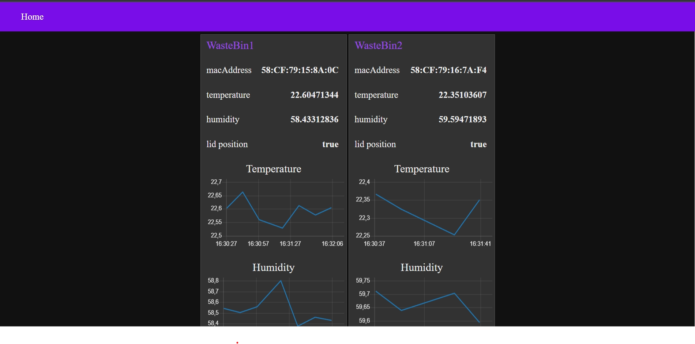

Het Gebruik van Meerdere ESP32-Microcontrollers met Node-Red
=========

Meerdere ESP32-microcontrollers kunnen in combinatie met Node-Red worden gebruikt om een visuele interface te bouwen op basis van de gegevens die zijn gelogd door de ESP32. Elke ESP32 kan worden geconfigureerd om gegevens van een specifieke sensor of apparaat te loggen en deze via Wi-Fi naar Node-Red te verzenden. Node-Red kan vervolgens de gegevens ontvangen en verwerken met behulp van verschillende nodes.

Bijvoorbeeld, als we drie ESP32-microcontrollers hebben die temperatuur- en luchtvochtigheidsgegevens registreren van drie verschillende locaties, kunnen we elke ESP32 configureren om de gegevens via Wi-Fi naar Node-Red te verzenden. Node-Red kan vervolgens de gegevens ontvangen en deze visualiseren door middel van bijvoorbeeld diagrammen of grafieken. Vervolgens kunnen de gegevens worden doorgestuurd naar een database.

### Onderbouwing keuze ESP32 C3

Wij kiezen voor een ESP32 omdat deze:

- Relatief goedkoop zijn (€2 per stuk).
- Beschikbaar zijn (1300 in stock bij Mouser, afhankelijk van model).
- Adequaat voor de taken die moeten worden uitgevoerd.
- Klein formaat.

### Waarom geen Arduino of Raspberry Pi als computer voor de WasteBin?

Raspbery pi’s zijn op dit moment zeer lastig verkrijgbaar, erg duur in de aanschaf voor een testplatform en daarnaast veel tijdsintensiever om op te zetten. Hiernaast zijn deze veel te krachtig voor onze doeleinden en is zo’n Raspberry Pi erg overbodig op het gebied van rekenkracht.
Arduino’s zijn redelijke alternatieven, maar duurder dan losse ESP32 modules. Los hiervan kan je een ESP32 wel programmeren via de Arduino IDE met de Arduino code librarys indien gewenst.

### Data forwarding

Data forwarding is de plek waar alle data van de ESP32’s (of wastebins) terecht komt. Het is een optie om daarvoor specifieke hardware te gebruiken zoals een raspberry pi met daarop een broker (zoals mosquitto) en een nodered dashboard).
Wij kiezen ervoor om met het prototype de broker en dashboard op onze lokale laptop te installeren en geen raspberry pi te gebruiken. We hebben hiervoor meerdere redenen:

1. We hebben een extra platform nodig (raspberry pi). Alles op 1 apparaat vinden wij makkelijker. Raspberry pi’s zijn tevens lastig verkrijgbaar en een extra bron voor fouten in hardware (sd kaart corruptie) en software (Linux problemen) etc.
2. Als wij fysiek ergens anders willen werken moeten wij iedere keer de raspberry pi via een beeldscherm en toetsenbord verbinden met het netwerk dat zich op die plek bevind.
3. De raspberry pi is mogelijk een beveiligings risico.

Stappen:

1. ESP32 data laten versturen (verbinden met internet)
2. MQTT-broker opzetten
3. MQTT-broker data van ESP32 accepteren
4. MQTT-broker data doorsturen naar Node-Red (lokaal)
5. Ingaande data van MQTT-broker omzetten naar dashboardweergave
6. data van Node-Red doorsturen naar een database

### De Data

De data die wij willen versturen vanaf de ESP32:
• Temperatuur (double)
• Luchtvochtigheid (double)
• Klepstand (boolean)
• Error code(s) (int)
• WasteBin-ID (macaddress)

Deze data word via MQTT naar Node-Red verstuurd. Vanuit daar word de data weer doorgestuurd naar een SQLITE database. We kiezen voor SQLITE vanwege de SQLITEstudio omgeving waarin we makkelijker de database kunnen ontwerpen, opbouwen en testen.

### Meldingen voor de gebruiker

Voor onze opstelling willen wij een speaker als indicator gebruiken, die verschillende waarschuwingen kan afgeven wanneer deze zich voordoen. Dit zijn:

- De klep staat te lang open (misschien)
- De binnenkant van de bak is te warm (vermoedelijk klep open of slechte koeling)
- General error (Ander probleem)

Wij kiezen ervoor om deze waarschuwingen ook mee te sturen naar ons dashboard mochten deze zich voordoen. Deze waarschuwingen worden weergegeven als een error code.

### Verstuur interval

In principe word alle data verstuurd elke 15 minuten. Wij denken dat dit genoeg informatie is voor iedere vuilnisbak om te kunnen waarnemen dat er een probleem is ontstaan (te lage temperatuur bijvoorbeeld). Daarnaast word op deze manier de Database niet overvloed met data. Dit kan namelijk snel te veel worden met 30 vuilnisbakken.

#### In geval van errors

In het geval van een error zal dit interval worden genegeerd. Het interval, mochten één of meerdere errors zich blijven voordoen, bedraagt 2 minuten.

## Node-Red

Zoals benoemd gaan wij Node-Red gebruiken om alle data vanuit MQTT te ontvangen, verwerken en te weergeven. Alle ontvangen informatie word weergeven via een Node-Red UI tabblad. Deze UI tabblad of "dashboard" zoals Node-Red het noemt is uitbreidbaar indien gewenst. Alle prototype vuilnisbakken zouden in real time weergeven kunnen worden indien dit gewenst zou zijn.
De Node-Red UI ziet er voor twee vuilnisbakken als volgt uit: 

### Node-Red flow

Om dit allemaal werkend te krijgen hebben wij een Node-Red flow gemaakt.
De Node-Red flow ziet er als volgt uit: 
In deze flow word via de eerste Node (paars) de MQTT data ontvangen. Vervolgens word er een timestamp toegevoegd aan het bericht en worden alle inkomende berichten van elkaar gescheiden via een switch. De data word gescheiden op basis van het macaddress (uniek) van de vuilnisbak.

Als de berichten zijn afgesplitst komen ze in een groot functie blok (oranje) dat de het bericht uit elkaar trekt en verdeeld over de outputs van het functieblok. Ik kies hiervoor omdat op deze manier het functie blok modulair blijft en de output daarmee ook. De output word gestuurd naar dashboard blokken (blauw) en naar nieuwe functie blokken die de extra data toevoegen (sensoridnr) en het als query naar een SQLITE database stuurt.

### DataBase
